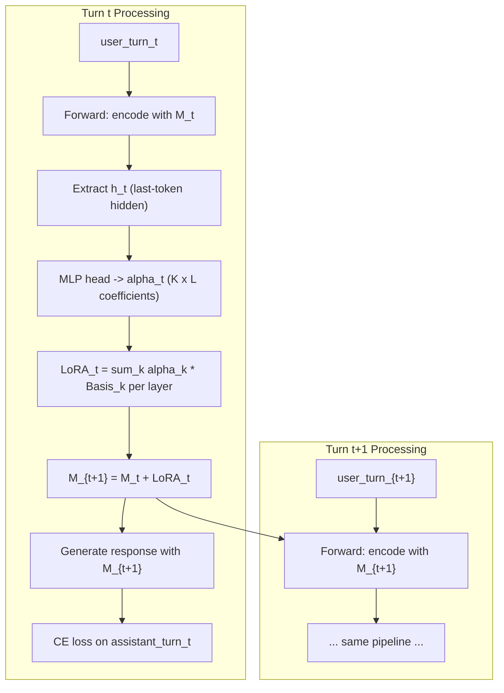
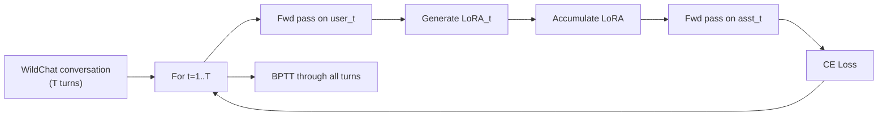

# Online Internalization: Learning from Conversations via Recursive LoRA Generation

## 1. Idea Assessment

**Core thesis**: Instead of appending conversation history to a growing context, train an LLM to *internalize* past turns into its own parameters by generating and accumulating LoRA adapters recursively. This yields constant-length context and a model that genuinely adapts over the course of a conversation.

**Strengths**:
- Addresses a real, practical limitation (context growth, no true learning from conversation)
- Clean, well-motivated formulation with a natural recursive structure
- Builds on your PAW work — generating LoRA adapters is a proven mechanism
- The "fixed bases + mixing coefficients" idea is elegant and makes the approach memory-efficient
- Clear baselines and evaluation protocol
- Strong stretch goals that could elevate the paper significantly

**Risks and mitigations**:
- *Training instability from recursive LoRA generation*: Mitigate with truncated BPTT, gradient clipping, warmup, and detached-gradient ablations
- *Full-context baseline may be very strong*: This is expected; the contribution is efficiency (constant memory) + genuine learning. Show the gap narrows with more turns and that internalization extrapolates beyond training context lengths
- *Memory during multi-turn rollouts*: Gradient checkpointing across turns + the mixing-coefficient approach keeps memory tractable
- *Closely related to TTT (Test-Time Training, Sun et al. 2024)*: Must differentiate clearly — TTT operates token-by-token with self-supervised loss within a layer; this operates turn-by-turn, generates updates directly, and targets multi-turn dialogue

**Key related work to position against**:
- **TTT / TTT-Linear (Sun et al., 2024)**: Self-supervised gradient updates within attention replacement. Different granularity (token vs. turn), different update mechanism (gradient vs. direct generation)
- **Fast Weights (Ba et al., 2016; Schlag et al., 2021)**: Associative memory via outer products. Related in spirit but not applied to LoRA or multi-turn conversation
- **Hypernetworks (Ha et al., 2016)**: Generate weights for another network. Related architecture, but not recursive/online
- **MAML / Meta-learning**: Gradient-based adaptation. We generate updates directly rather than taking gradient steps
- **Programs as Weights (your own work)**: Direct predecessor — the novelty here is the recursive/online application to conversation

---

## 2. Technical Design

### 2.1 Architecture

```
Turn t arrives:
  1. Forward pass: encode user_turn_t with current model M_t
  2. Extract representation h_t (e.g., last-token hidden state or mean pool)
  3. MLP head: h_t -> mixing coefficients alpha_t in R^{K x L}
     (K = number of bases, L = number of adapted layers)
  4. Compute LoRA_t = sum_k alpha_t[k,l] * B_k_l for each layer l
     where B_k_l are learnable basis LoRA matrices (A_k, B_k pairs)
  5. Apply: M_{t+1} = M_t + LoRA_t  (additive LoRA accumulation)
  6. Generate response: M_{t+1}(user_turn_t) -> assistant_turn_t
  7. Loss: cross-entropy on assistant_turn_t tokens
```



**Key design decisions**:
- **Base model**: Start with **Qwen-3.5-0.8B** (good quality, small enough for fast iteration). Scale to 3B/7B for final results.
- **LoRA targets**: All attention projections (Q, K, V, O) across all layers
- **LoRA rank**: Start with r=8, ablate over {4, 8, 16, 32}
- **Number of bases K**: Start with K=16, ablate over {4, 8, 16, 32, 64}
- **Mixing coefficient extraction**: Append a special `[ADAPT]` token to the user turn; use its final hidden state
- **Basis initialization**: Random orthogonal initialization for A matrices, zero for B matrices (standard LoRA init)

### 2.2 Training Procedure



- **Backpropagation**: Full BPTT through the chain of LoRA generations. Start with **detached-gradient variant** (treat previously accumulated LoRAs as constants during backward pass) as a simpler baseline, then compare to full BPTT.
- **Gradient checkpointing**: Checkpoint at each turn boundary to keep memory O(1) in number of turns
- **Optimizer**: AdamW, lr=1e-4 with cosine schedule, warmup 1000 steps
- **What is trained**: The MLP coefficient head + the K basis LoRA pairs. The base model is **frozen**.
- **Batch size**: 1 conversation per GPU (conversations vary in length), accumulate gradients across conversations

### 2.3 Memory Optimization via Hooks

The trick: we only need **one copy** of the base model weights in memory. The LoRA adapters are applied additively via forward hooks that intercept linear layer computations:

```python
# Pseudocode
class LoRAHook:
    def __init__(self, base_linear):
        self.base_linear = base_linear
        self.accumulated_lora_A = None  # low-rank, small
        self.accumulated_lora_B = None

    def __call__(self, module, input, output):
        if self.accumulated_lora_A is not None:
            # output += input @ A @ B  (LoRA additive term)
            lora_out = input @ self.accumulated_lora_A @ self.accumulated_lora_B
            return output + lora_out
        return output
```

This avoids ever materializing a full modified weight matrix.

---

## 3. Data Preparation

### 3.1 Dataset: WildChat

- Source: `yuntian-deng/WildChat-4.8M-Full` on Hugging Face (you already have loading code in `humanorllm-tinydetector/data_utils.py`)
- **Step 1: Distribution analysis** — plot histogram of conversation lengths (number of turns), filter for English conversations
- **Step 2: Filtering** — keep conversations with >= 5 turns (user+assistant pairs). Analyze what threshold gives a good balance of data volume vs. conversation depth
- **Step 3: Splits** — random split by conversation_id: 80/10/10 train/val/test
- **Step 4: Preprocessing** — tokenize with the base model tokenizer, cache as arrow/parquet files

**Expected data stats** (to verify):
- WildChat has ~4.8M conversations
- A significant fraction should have 5+ turns; the distribution analysis will confirm

### 3.2 Knowledge-Update Dataset (Stretch Goal)

For the temporal knowledge experiment:
- Use model with training cutoff before 2025 (e.g., Qwen-3.5 or Llama-3.1)
- Collect WildChat conversations from 2025 that reference 2025 events
- Create a knowledge probe: questions about 2025 events with known answers
- Test: after internalizing 2025 conversations, can the model answer 2025 knowledge questions?

---

## 4. Experiments

### 4.1 Core Comparison (Priority 1 — must have)

| Setting | Input at turn t | Parameters | Context length |
|---------|----------------|------------|---------------|
| **(1) Current-turn only** | user_t only | Frozen base | Constant (1 turn) |
| **(2) Online Internalization (ours)** | user_t + accumulated LoRAs from turns 1..t-1 | Frozen base + LoRA bases + MLP head | Constant (1 turn + LoRA) |
| **(3) Full-context oracle** | all turns 1..t | Fine-tuned or frozen base | Growing (all turns) |

**Metrics**: Perplexity on assistant turns (primary), and generation quality (ROUGE/BERTScore as secondary)

**Training details for each setting**:
- **(1)**: Fine-tune base model on (user_t, assistant_t) pairs, no history
- **(2)**: Train LoRA generation module end-to-end as described above
- **(3)**: Fine-tune base model on (full_history + user_t, assistant_t), standard SFT

**Expected outcome**: (1) << (2) <= (3) in terms of perplexity. Setting (2) should significantly beat (1) and ideally approach (3), especially at later turns where context grows large.

### 4.2 Ablations (Priority 2 — important for understanding)

- **Number of LoRA bases K**: {4, 8, 16, 32, 64}
- **LoRA rank r**: {4, 8, 16, 32}
- **BPTT depth**: {1, 2, 4, full} — how many turns to backprop through
- **Which layers to adapt**: {attention only, attention+MLP, every other layer}
- **Coefficient extraction**: {last token, mean pool, [ADAPT] token}
- **Accumulation strategy**: {additive, replace (only use latest LoRA), weighted average with decay}

### 4.3 Scaling Analysis (Priority 2)

- **Performance vs. number of turns**: Plot perplexity at each turn position. Does our approach keep improving as turns increase? Does full-context degrade after the context window is exceeded?
- **Performance vs. model size**: Try 0.8B, 3B, 7B base models
- **Performance vs. number of bases/rank**: Pareto frontier of quality vs. parameter count

### 4.4 Context Length Extrapolation (Priority 1 — strong selling point)

- Train on conversations with 5-10 turns
- Evaluate on conversations with 15, 20, 30+ turns
- Compare against full-context model which will hit context window limits
- Our approach should gracefully handle arbitrary conversation lengths since context is constant

### 4.5 Knowledge Update Experiment (Priority 3 — stretch goal)

- Take Qwen-3.5-0.8B
- Internalize WildChat conversations from late 2024 / 2025
- Evaluate on temporal knowledge probes
- Compare: (a) base model, (b) model after internalizing conversations, (c) model with conversations in context

### 4.6 Cross-User Transfer (Priority 3 — stretch goal)

- Group WildChat conversations by user (using hashed IP or user_id if available)
- Train on conversations from users {1, ..., N}
- Test on held-out users {N+1, ...}
- Measure: does seeing more users during training help with new users?
- Further: after deployment, does internalizing the first few turns of a new user help predict later turns of that same user?

---

## 5. Repository Structure

```
# online_internalization/
├── README.md                          # Project overview, setup, how to reproduce
├── requirements.txt                   # Dependencies with pinned versions
├── docs/
│   ├── PLAN.md                        # This plan (living document)
│   ├── DECISIONS.md                   # Log of all design decisions with rationale
│   ├── EXPERIMENT_LOG.md              # Running log of all experiments
│   └── RELATED_WORK.md               # Notes on related papers
├── configs/
│   ├── base.yaml                      # Default hyperparameters
│   ├── ablation_rank.yaml             # Rank ablation configs
│   ├── ablation_bases.yaml            # Basis count ablation configs
│   └── ...
├── src/
│   ├── data/
│   │   ├── wildchat_loader.py         # Load & filter WildChat
│   │   ├── wildchat_analysis.py       # Turn distribution analysis
│   │   └── data_collator.py           # Multi-turn conversation collator
│   ├── model/
│   │   ├── lora_bases.py              # Learnable LoRA basis matrices
│   │   ├── coefficient_head.py        # MLP that predicts mixing coefficients
│   │   ├── lora_hooks.py              # Forward hooks for LoRA application
│   │   ├── online_internalization.py  # Main model: recursive LoRA generation
│   │   └── baselines.py              # Current-turn-only and full-context models
│   ├── training/
│   │   ├── trainer.py                 # Multi-turn BPTT trainer
│   │   ├── memory_utils.py            # Gradient checkpointing, hook management
│   │   └── train.py                   # Main training entrypoint
│   ├── evaluation/
│   │   ├── perplexity.py              # Per-turn perplexity evaluation
│   │   ├── generation.py              # Response generation + metrics
│   │   └── knowledge_probes.py        # Temporal knowledge evaluation
│   └── utils/
│       ├── logging_utils.py           # Experiment logging to markdown + wandb
│       └── config.py                  # Config management
├── scripts/
│   ├── analyze_wildchat.py            # Data analysis entry point
│   ├── train_baseline_current.py      # Train setting (1)
│   ├── train_internalization.py       # Train setting (2)
│   ├── train_baseline_fullctx.py      # Train setting (3)
│   ├── evaluate.py                    # Evaluation entry point
│   └── run_ablations.sh               # Launch all ablation experiments
├── experiments/                        # Auto-populated experiment outputs
│   ├── run_001_baseline_current/
│   │   ├── config.yaml
│   │   ├── metrics.json
│   │   ├── train.log
│   │   └── checkpoints/
│   └── ...
└── notebooks/
    ├── 01_data_analysis.ipynb          # WildChat distribution analysis
    ├── 02_proof_of_concept.ipynb       # Quick PoC before full training
    └── 03_results_visualization.ipynb  # Plots for paper
```

---

## 6. Implementation Order

### Phase 0: Setup and Data Analysis (Week 1)
- Initialize repo, install dependencies, set up logging infrastructure
- Download WildChat, run distribution analysis
- Determine optimal turn-count threshold
- Create train/val/test splits

### Phase 1: Proof of Concept (Weeks 2-3)
- Implement LoRA bases + coefficient head modules
- Implement forward hooks for LoRA application
- Test on **2-turn conversations** (simplest case: one LoRA generation + one response)
- Verify gradients flow correctly, loss decreases
- Implement baseline (1): current-turn-only model

### Phase 2: Multi-Turn + Core Results (Weeks 3-5)
- Extend to recursive multi-turn LoRA generation
- Implement gradient checkpointing across turns
- Implement full BPTT and detached-gradient variants
- Train all three settings on full filtered WildChat
- Compute perplexity curves; produce core results table

### Phase 3: Ablations and Analysis (Weeks 5-7)
- Run all ablation experiments (rank, bases, BPTT depth, layers, etc.)
- Context length extrapolation experiments
- Generate analysis plots (per-turn perplexity, scaling curves, Pareto frontiers)
- Inspect learned LoRA bases qualitatively

### Phase 4: Stretch Goals (Weeks 7-9)
- Knowledge update experiment
- Cross-user transfer experiment
- Additional baselines if needed (e.g., sliding window context, summary-based compression)

### Phase 5: Paper (Weeks 9-12)
- Write paper draft following ICLR format
- Iterate on presentation based on results
- Additional experiments to address anticipated reviewer concerns

---

## 7. Compute Estimate

- **Base model**: Qwen-3.5-0.8B (~1.6GB in fp16)
- **Training a 10-turn conversation**: ~10 forward passes + 1 backward pass through the chain. Roughly 10x a single forward-backward on a 0.8B model.
- **Estimated per-step memory**: ~12-16GB with gradient checkpointing — fits comfortably on a single A100-40GB or even an RTX 4090-24GB
- **Training time estimate**: ~1-2 days for core experiments on 4x A100s
- **Total GPU budget**: ~100-200 A100-hours for all experiments including ablations

---

## 8. Logging Protocol

All decisions, experiments, and raw outputs should be tracked in the repo:

- **`docs/DECISIONS.md`**: Every design choice with date, alternatives considered, and rationale
- **`docs/EXPERIMENT_LOG.md`**: For each experiment run: date, config, hypothesis, result summary, link to full logs
- **`experiments/run_XXX/`**: Full config, metrics, training logs, checkpoints for every run
- **W&B integration**: All training curves logged to Weights & Biases for real-time monitoring
- **Git commits**: Each significant experiment or code change gets a descriptive commit

This ensures any student can pick up the project, understand what was tried, and continue from any point.
